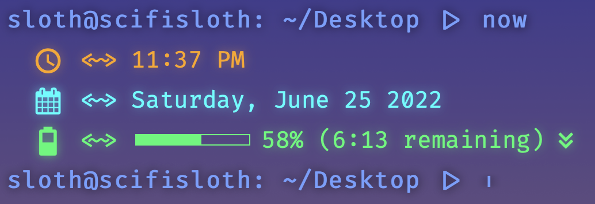

# Bash Terminal Widget
A simple bash terminal styled widget for Übersicht.  
I saw a really cool terminal widget for the desktop by [vecnehladny](https://github.com/vecnehladny), and thought that I could learn a thing or two by trying to customise it as much as I could, to suit my needs.




## Features
**Clock**  
Just the usual time stuff.

**Date**  
Just the usual date stuff.

**Username**  
Shows the username and hostname of the device.

**Battery status**  
Shows the battery percentage, and remaining time to discharge/recharge. The bar accurately displays the percentage, along with the battery icon, and changes color based on the battery percentage left.

**Animated Cursor**  
The cursor is an expanding cursor, animated using CSS animations.

 
## Installation
1. Download and install Übersicht from their [website](http://tracesof.net/uebersicht/).
2. Clone this repository.

```
git clone https://github.com/IndraSigicharla/ubersicht-terminal-widget ~/Library/Application\ Support/Übersicht/widgets/ubersicht-terminal-widget/
```

## Requirements
1. Übersicht, of course.
2. To make the icons appear properly, I recommend having a Nerd Font installed, especially [Fira Code](https://github.com/ryanoasis/nerd-fonts) Nerd font.

## Customization
You can set brightness of the neon effect, and you can edit the CSS to customise the widget in any other way.
```
brightness = 10
```

## Enjoy!
Fork it, learn with it, do whatever with it. Just remember to have fun!

